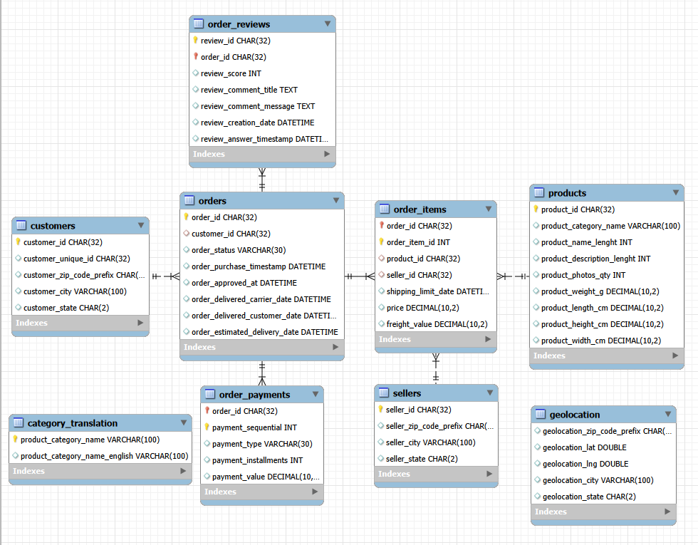

# Olist E-Commerce SQL Analysis

## Project Overview

This project analyzes the Olist Brazilian E-Commerce dataset using MySQL to evaluate product sales performance, revenue concentration, delivery performance, and customer experience.

The project was designed to simulate a business analysis workflow in which raw relational data is validated, modeled, queried, and translated into management-relevant insights.

## Dataset

Source: Olist Brazilian E-Commerce Public Dataset on Kaggle

The dataset contains approximately 100,000 orders across multiple relational tables, including:

customers  
orders  
order_items  
order_payments  
order_reviews  
products  
sellers  
geolocation  
category_translation

## Tools

MySQL  
MySQL Workbench  
GitHub

## Database Structure

The analysis uses `orders` as the central transaction table.

Key relationships include:

orders → customers  
orders → order_items  
order_items → products  
order_items → sellers  
orders → order_reviews  
orders → order_payments

`category_translation` is joined to `products` using `product_category_name` for English category labels.

`geolocation` can be linked through ZIP code prefixes for location analysis, but the ZIP prefix is not unique and was not implemented as a formal foreign key.

### Entity Relationship Diagram



## Project Files

```text
01_create_tables.sql
02_load_data.sql
03_data_validation.sql
04_constraints.sql
05_revenue_performance.sql
06_revenue_concentration.sql
07_delivery_customer_experience.sql
```

## Execution Order

Run the SQL files in the following order:

```text
1. 01_create_tables.sql
2. 02_load_data.sql
3. 03_data_validation.sql
4. 04_constraints.sql
5. 05_revenue_performance.sql
6. 06_revenue_concentration.sql
7. 07_delivery_customer_experience.sql
```

## Setup

Create the database:

```sql
CREATE DATABASE olist_ecommerce;
USE olist_ecommerce;
```

Download the Olist CSV files and update the file paths in `02_load_data.sql`.

Example:

```sql
LOAD DATA LOCAL INFILE 'C:/path/to/olist_data/olist_orders_dataset.csv'
INTO TABLE orders
...
```

The CSV files are not included in this repository.

## Analysis Scope

Product Sales is defined as:

```sql
SUM(order_items.price)
```

Freight is analyzed separately and is not treated as Product Sales.

Sales-related analyses use delivered orders only.

The main trend analysis covers January 2017 through August 2018. Incomplete boundary periods in the source dataset were excluded to avoid misleading growth comparisons.

## Analysis 1: Revenue Performance

### Business Question

How is the business performing, and what is driving Product Sales growth?

The analysis includes:

Monthly Product Sales and MoM growth  
Product Sales by category  
Category sales share  
Top 5 category sales contribution  
2017 H2 vs 2018 H1 category growth  
Growth concentration

### Key Findings

The top five product categories generated 39.88% of Product Sales.

50 of 72 category groups grew from 2017 H2 to 2018 H1, representing 69.44% of categories.

The top five growth categories contributed 45.18% of total positive growth.

Growth was therefore relatively broad based, although a meaningful share of incremental sales remained concentrated in the strongest categories.

## Analysis 2: Revenue Concentration & Dependency Risk

### Business Question

Where is Product Sales concentrated, and where does potential dependency risk lie?

Concentration was evaluated across customers, product categories, and sellers.

### Customer Concentration

Top 1% of customers: 11.48% of Product Sales  
Top 5%: 29.14%  
Top 10%: 41.10%  
Top 20%: 56.62%

Only 3.00% of customers placed more than one order, and repeat customers contributed only 5.50% of Product Sales.

This suggests that customer concentration is driven more by purchase value than by dependence on a small group of repeat customers.

### Category Concentration

Top 1% of categories: 9.33%  
Top 5%: 33.14%  
Top 10%: 54.52%  
Top 20%: 76.33%

### Seller Concentration

Top 1% of sellers: 25.93%  
Top 5%: 52.99%  
Top 10%: 67.04%  
Top 20%: 82.20%

Seller concentration was the strongest potential dependency risk identified in the dataset.

This result indicates concentration risk, but does not by itself establish operational supply risk because the dataset does not contain seller substitution, contract, or capacity information.

## Analysis 3: Delivery Performance & Customer Experience

### Business Question

Where are delivery problems occurring, and how are they associated with customer satisfaction?

### Overall Delivery Performance

7,822 of 96,203 delivered orders arrived after the estimated delivery date.

Late delivery rate: 8.13%

### Seller Tier Analysis

Seller tiers were defined based on cumulative Product Sales contribution.

Tier A late rate: 8.47%  
Tier B late rate: 7.41%  
Tier C late rate: 8.08%

The similarity across tiers suggests that seller sales tier does not meaningfully explain late delivery performance.

### Geographic Differences

Late delivery rates varied substantially across customer destination states.

Examples of higher late rates included:

AL: 23.99%  
MA: 19.64%  
CE: 15.40%  
BA: 14.05%  
RJ: 13.52%

Large markets with lower late rates included:

SP: 5.90%  
MG: 5.63%  
PR: 5.02%

Delivery issues therefore appear more geographically concentrated than explained by seller sales tier.

The dataset does not contain carrier, route, distribution center, or logistics network data, so the underlying operational cause cannot be determined.

### Delivery Timing and Review Scores

Reviews were deduplicated by retaining the latest review for each order.

Average review score declined as delivery performance worsened:

```text
10+ days early          4.32
3–10 days early         4.25
0–3 days early          4.13
On time to 3 days late  3.59
3–7 days late           2.10
7–15 days late          1.67
15+ days late           1.73
```

The largest deterioration occurred once delivery delays exceeded approximately three days.

Late orders also had a 53.76% one-star review rate compared with 6.60% for on-time orders.

Late delivery was therefore strongly associated with lower customer satisfaction.

## Key SQL Techniques

JOIN  
LEFT JOIN  
GROUP BY  
CASE WHEN  
CTEs  
Window Functions  
ROW_NUMBER  
LAG  
SUM OVER  
DATEDIFF  
DATE_FORMAT  
NULL handling  
Data validation and referential integrity checks

## Key Data Considerations

`customer_id` does not uniquely represent the same person across multiple orders. Customer-level analysis therefore uses `customer_unique_id`.

`order_items` is item-level data, so one order may contain multiple rows.

`order_payments` may contain multiple payment records for one order.

`geolocation_zip_code_prefix` is not unique and must be handled carefully to avoid row multiplication.

Some orders contain multiple review records. Review analysis retains the latest review per order.

## Portfolio

A summarized business case study based on this analysis is available on my personal portfolio website.

Full SQL queries and methodology are available in this repository.
